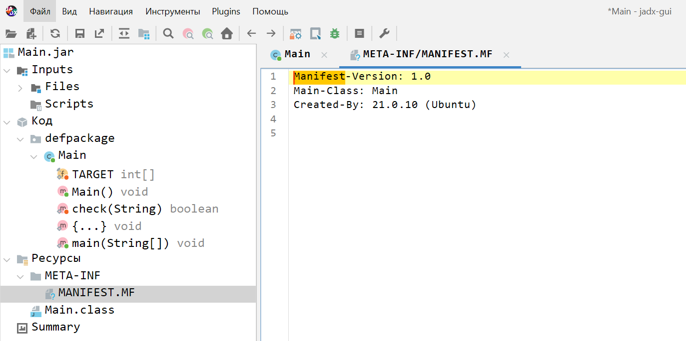
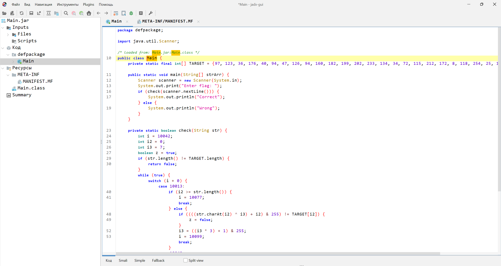
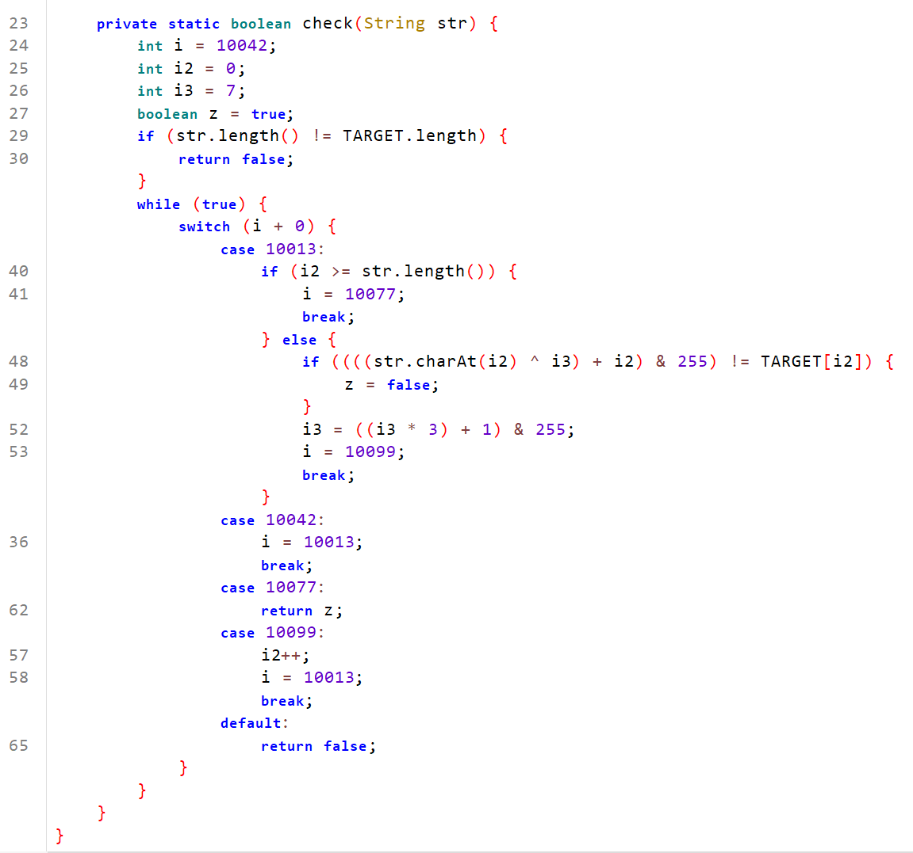
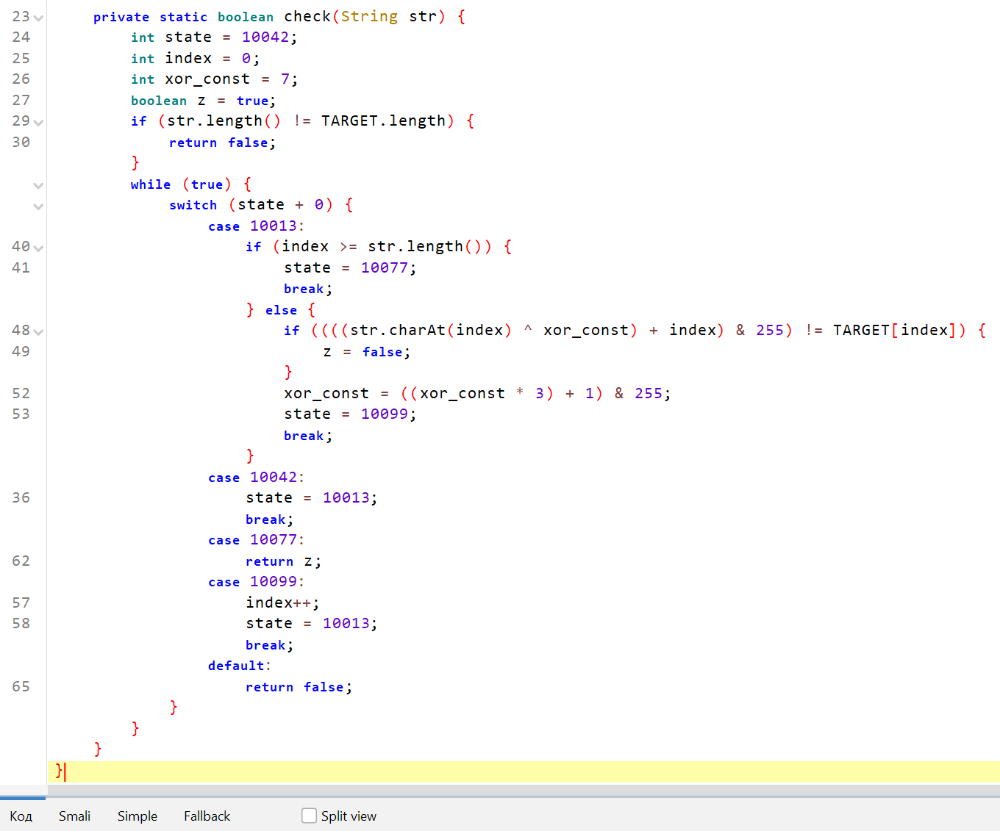

# 1 | Easy | Reverse

## Информация

Simple .jar

## Выдать участинкам

`Main.jar` из директории [public/](public/)

## Описание

Проверка пароля на Java, обфусцированная с помощью CFG

## Решение

0. Запускаем Main.jar с помощью команды `java -jar Main.jar`. Видим, что просит пароль.
1. Открываем в jadx файл Main.jar. Находим файл MANIFEST.MF, из которого узнаём, что главный класс - `Main`.

2. Переходим в код класса `Main`

3. Выполнение начинается с функции `main()`. В ней считывается флаг и передаётся на проверку в функцию `check()`
4. В функции `check()` видна обфускация CFG с небольшим switch-case

5. Если длина введённой строки не равна длине массива `TARGET`, проверка завершается с неудачей
6. Далее дадим переменным подходящие названия (можно кликнуть ПКМ по переменной в месте, где она объявлена): `i` - `state`, `i2` - `index`, `i3` - `xor_const`

7. Всё начинается с состояния 10042. После состояние меняется на 10013. 
8. В состоянии 10013, если вышли за границы строки, переходим в состояние 10077, которое возвращает результат проверки. Если не вышли за границы строки, символ на текущей позиции ксорим с `xor_const`, прибавляем `index` и делаем побитовое И с числом 255. Если полученный символ не совпадает с символом на той же позиции в `TARGET`, устанавливаем результат сравнения в `false`. После этого преобразуем `xor_const` и переходим в состояние 10099.
9. Состояние 10099 увеличивает текущий индекс на 1 и переносит в состояние 10013, которое снова проверяет текущий символ.
10. Таким образом, чтобы узнать правильный флаг, нужно каждый элемент массива `TARGET` обработать обратным алгоритмом и не забывать после каждого символа обновлять `xor_const`

Алгоритм декодирования на Python представлен ниже
[Решение на Python](solve/solve.py)

## Флаг

`flag{Grea1_f1rs1_TasK_S0lveD}`

